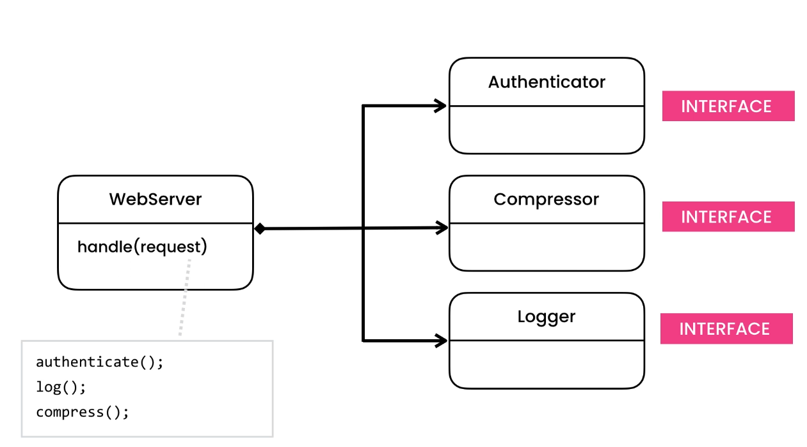

# Chain Of Responsibility Design Pattern

> Allows building a chain of objects to process a request.

## Intent

- Chain of Responsibility is a behavioral design pattern that lets you pass requests along a chain of handlers. Upon
  receiving a request, each handler decides either to process the request or to pass it to the next handler in the
  chain.
- We need some sort of chain or pipeline to handle a object.

## Problem

- HTTP Request (check Problem 1)
    - Because of the new keyword, this class is tightly coupled with authenticator, compressor etc. So in future, if we
      need to add a new operation we would need to update this class with a new set of lines responsible for taking care
      of the corresponding operation.

    - To solve this we can extract Authenticator, Compressor to an interface and provide it to the web server. Even
      though this will decouple these operation creation from the web server it will still contain the order of
      operations. In future, if we decide to disable any operation for eg logging, we need to comeback here change the
      code. This violates the OCP, as this code needs to be opened everytime for handling new type of operation.

## Solution

## Applicability

## Code

- [Problem - 1](./src/main/java/com/rohan/dp/cor/problem/ex1)
- [Solution - 1](./src/main/java/com/rohan/dp/cor/solution/ex1)

- [Problem - 2](./src/main/java/com/rohan/dp/cor/problem/ex1)
- [Example - 2](./src/main/java/com/rohan/dp/cor/solution/ex2)

## UML

- Here handler is like a linked list

- With below we need to update handle everytime, violated OCP
  
