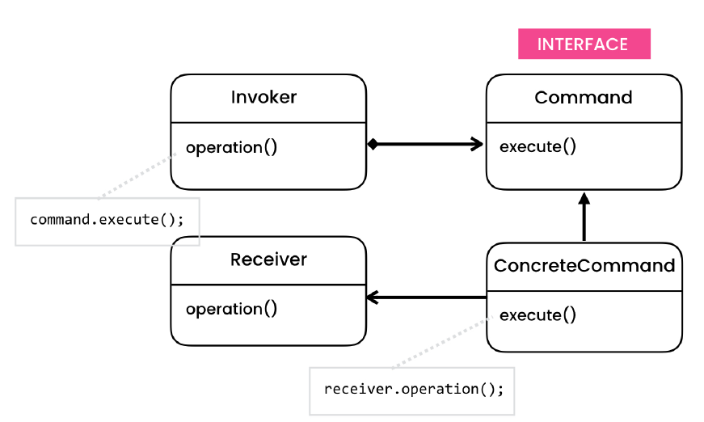
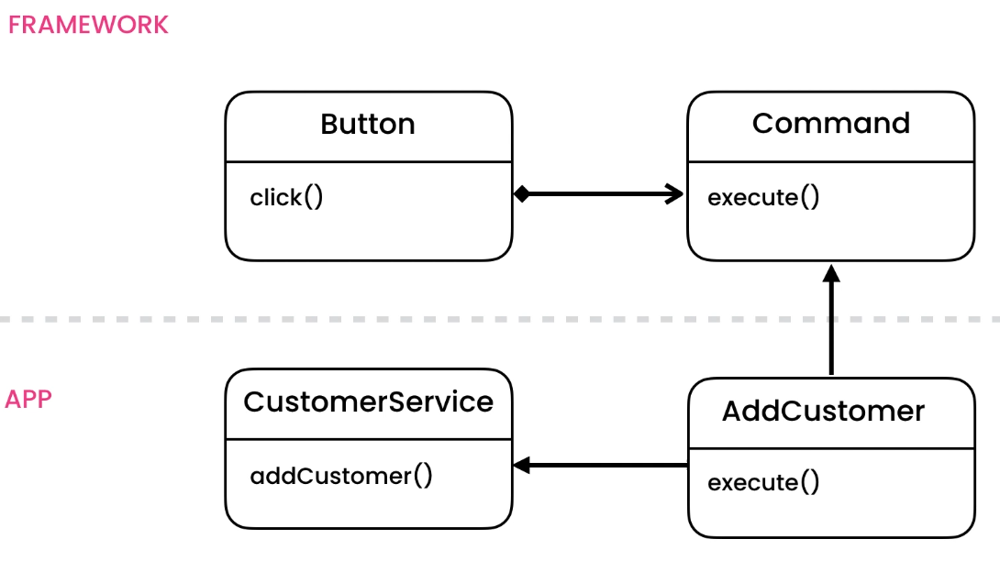
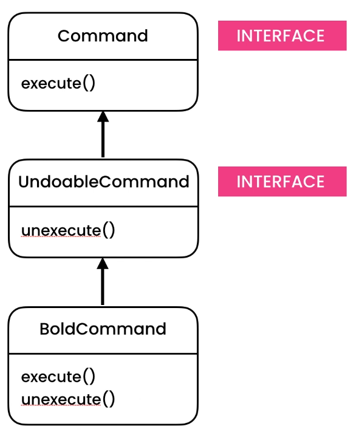

# Command Design Pattern

> Allows decouple a sender from a receiver. The sender will talk to the receiver through a command. Commands can be undone and persisted.

## Intent

Command is a behavioral design pattern that turns a request into a stand-alone object that contains all information
about the request. This transformation lets you pass requests as a method arguments, delay or queue a request’s
execution, and support undoable operations.

## Problem

- UI Framework

## Solution

- Delegation
- Decoupling sender from receive using delegation
- Commands can be stored for undo and redo operations
- Undo operation
    - Why don't we use Memento here?
        - Reverting a command is easy, as command is aware what it did
        - Storing state (video snapshot) of heavy object (like video) is not easy.
            - Will waste lot of memory

## Applicability

- Use the Command pattern when you want to parametrize objects with operations.
    - The Command pattern can turn a specific method call into a stand-alone object. This change opens up a lot of
      interesting uses: you can pass commands as method arguments, store them inside other objects, switch linked
      commands at runtime, etc.
    - Here’s an example: you’re developing a GUI component such as a context menu, and you want your users to be able to
      configure menu items that trigger operations when an end user clicks an item.
- Use the Command pattern when you want to queue operations, schedule their execution, or execute them remotely.
    - As with any other object, a command can be serialized, which means converting it to a string that can be easily
      written to a file or a database. Later, the string can be restored as the initial command object. Thus, you can
      delay and schedule command execution. But there’s even more! In the same way, you can queue, log or send commands
      over the network.
- Use the Command pattern when you want to implement reversible operations.
    - Although there are many ways to implement undo/redo, the Command pattern is perhaps the most popular of all.
    - To be able to revert operations, you need to implement the history of performed operations. The command history is
      a stack that contains all executed command objects along with related backups of the application’s state.
    - This method has two drawbacks. First, it isn’t that easy to save an application’s state because some of it can be
      private. This problem can be mitigated with the Memento pattern.
    - Second, the state backups may consume quite a lot of RAM. Therefore, sometimes you can resort to an alternative
      implementation: instead of restoring the past state, the command performs the inverse operation. The reverse
      operation also has a price: it may turn out to be hard or even impossible to implement.

## Code

- [Problem](./src/main/java/com/rohan/dp/command/problem)
- [Solution: Simple](src/main/java/com/rohan/dp/command/solution/ex1/simple)
- [Solution: Composite](src/main/java/com/rohan/dp/command/solution/ex1/composite)
- [Solution: Undo](src/main/java/com/rohan/dp/command/solution/ex1/undo)

## UML

- Solution (Simple)

- Problem (Undo)

- Solution (Undo)

