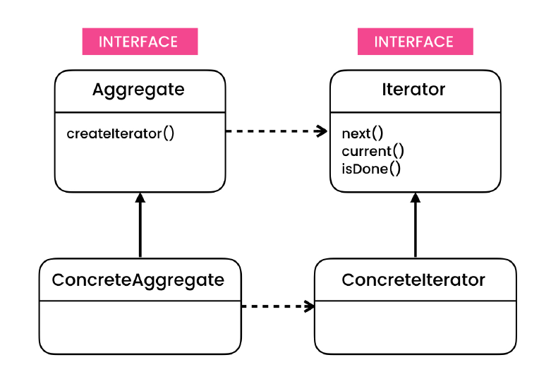
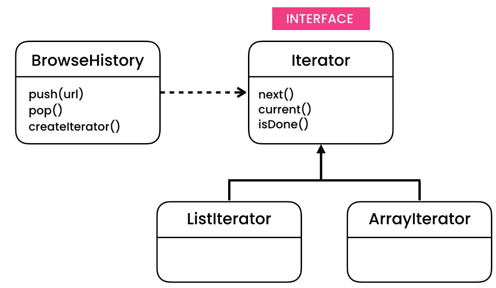

# Iterator Design Pattern
> Allows iterating over an object without having to expose the object’s internal
  structure (which may change in the future).

## Intent
Iterator is a behavioral design pattern that lets you traverse elements of a collection without exposing its underlying
representation (list, stack, tree, etc.).

## Problem
- When exposing internal data structure to consumer class. We have issues like:-
    - If we decide to change internal data structure in future, then dependent class is changed.

## Solution
The main idea of the Iterator pattern is to extract the traversal behavior of a collection into a separate 
object called an iterator.
- Only deal with breaking changes inside the class implementing the data structure.
- Outer class should not be aware whats happening inside the implementing class.
- It should be well encapsulated.
- Class having the collection should not implement Iterator but compose it. 
    - Iteration should be handled by different class (inner), so that it can access private members for easability. 

## Applicability
- **Use the Iterator pattern when your collection has a complex data structure under the hood, but you want to hide its
 complexity from clients (either for convenience or security reasons).**
    - The iterator encapsulates the details of working with a complex data structure, providing the client with several simple methods of accessing the collection elements. While this approach is very convenient for the client, it also protects the collection from careless or malicious actions which the client would be able to perform if working with the collection directly.

- **Use the pattern to reduce duplication of the traversal code across your app.**
    - The code of non-trivial iteration algorithms tends to be very bulky. When placed within the business logic of 
    an app, it may blur the responsibility of the original code and make it less maintainable. Moving the traversal 
    code to designated iterators can help you make the code of the application more lean and clean.

- **Use the Iterator when you want your code to be able to traverse different data structures or when types of these
 structures are unknown beforehand.**
    - The pattern provides a couple of generic interfaces for both collections and iterators. Given that your code now
     uses these interfaces, it’ll still work if you pass it various kinds of collections and iterators that implement 
     these interfaces.

## Code
- [Problem](./src/main/java/com/rohan/dp/iterator/problem)
- [Example - 1](./src/main/java/com/rohan/dp/iterator/solution/ex1)
- [Example - 2](./src/main/java/com/rohan/dp/iterator/solution/ex2)
- [Example - 3](./src/main/java/com/rohan/dp/iterator/solution/ex3)

## UML
- BrowserHistory handles collection management
- Iterator handles iteration
    - Depending on the type of internal data structure we can provide a common interface which doesn't care what's next 
    in the collection
        - List Iterator
        - Array Iterator
        - Map Iterator ...

