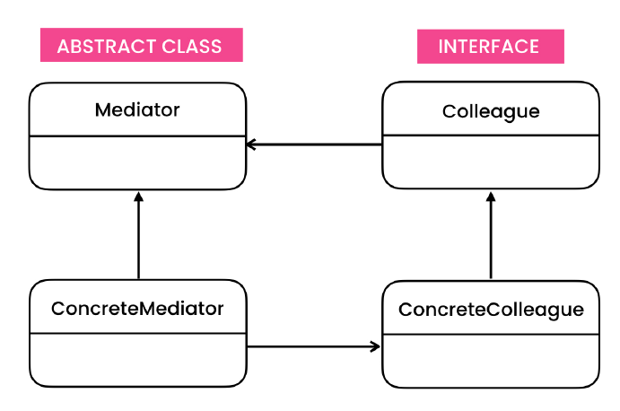

# Mediator Design Pattern
> Allows an object to encapsulate the communication between other objects.

## Intent

## Problem
      
## Solution

## Applicability

## Code
- [Problem](./src/main/java/com/rohan/dp/mediator/problem)
- [Example - 1](src/main/java/com/rohan/dp/mediator/solution/ex1/normal)
- [Example - 2](./src/main/java/com/rohan/dp/mediator/solution/ex2)

## UML

