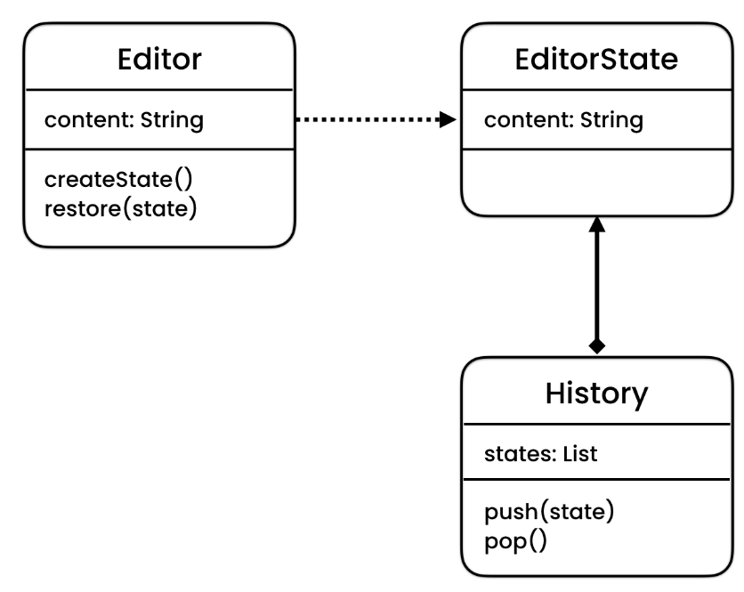

# Memento Design Pattern
> Allows restoring an object to a previous state.

## Intent
Memento is a behavioral design pattern that lets you save and restore the previous state of an object without revealing 
the details of its implementation.

## Problem
We want to undo or restore a state of an Object. 
- General approaches (TODO add UML)
    - Store last state
        - Can only go back to one type of state and only one level
    - Store a list of state
        - Violates SRP       

## Solution
The Memento pattern delegates creating the state snapshots to the actual owner of that state, the originator object.
Hence, instead of other objects trying to copy the editor’s state from the “outside,” the editor class itself can make
the snapshot since it has full access to its own state.

## Applicability
- **We use this pattern to implementing UNDO mechanism** 

- **Use the Memento pattern when you want to produce snapshots of the object’s state to be able to restore a previous state of the object.**
    - The Memento pattern lets you make full copies of an object’s state, including private fields, and store them
     separately from the object. While most people remember this pattern thanks to the “undo” use case, it’s also 
     indispensable when dealing with transactions (i.e., if you need to roll back an operation on error).
     
- **Use the pattern when direct access to the object’s fields/getters/setters violates its encapsulation.**
    - The Memento makes the object itself responsible for creating a snapshot of its state. No other object can
     read the snapshot, making the original object’s state data safe and secure.

## Code
- [Problem](./src/main/java/com/rohan/dp/memento/problem)
- [Example - 1](./src/main/java/com/rohan/dp/memento/solution/ex1)
- [Example - 2](./src/main/java/com/rohan/dp/memento/solution/ex2)

## UML
- It has 3 participants
    - Originator
    - Momento
    - Caretaker
   

