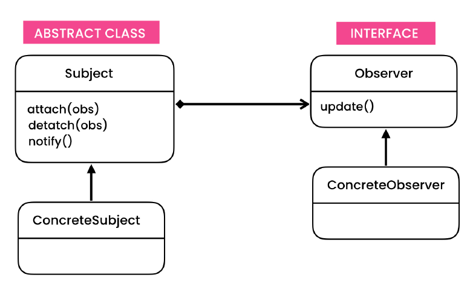
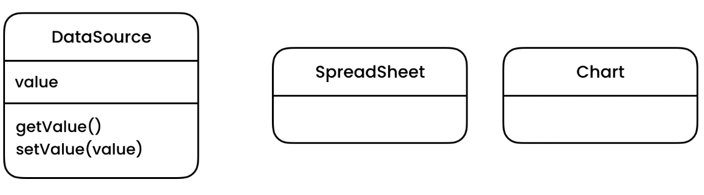
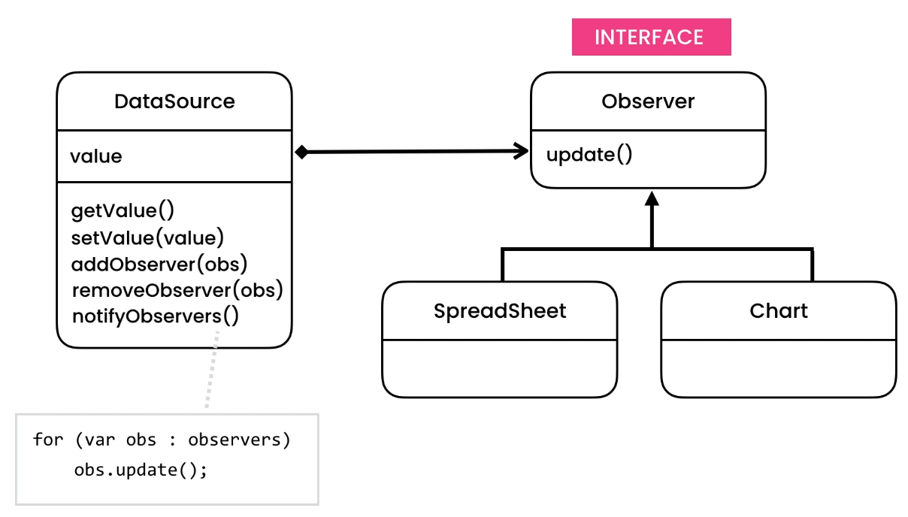
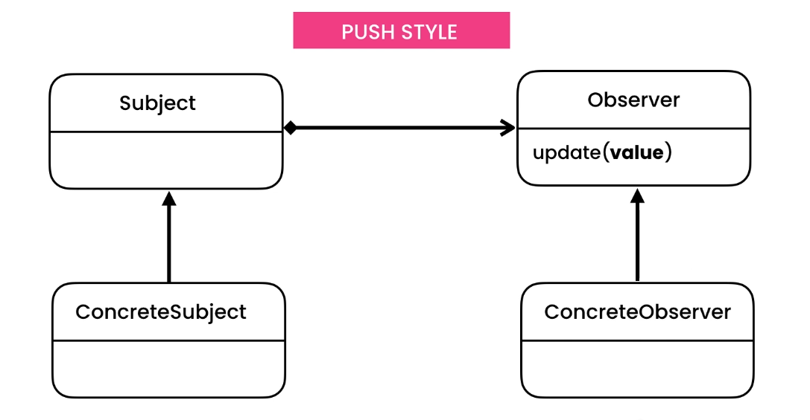
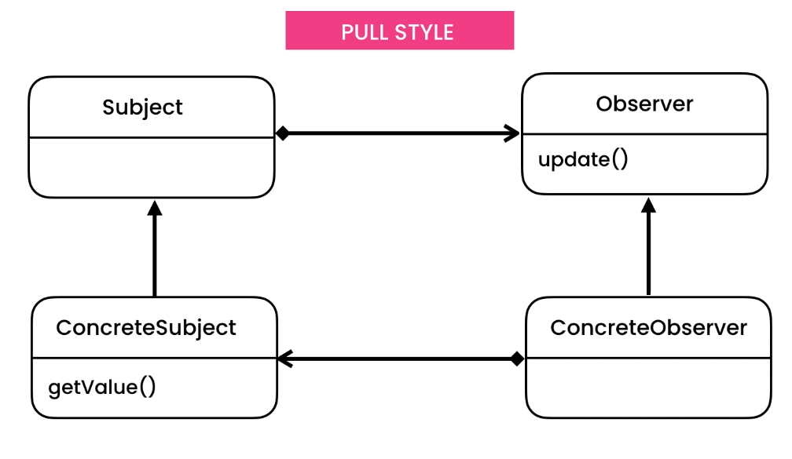

# Observer Design Pattern

> Allows an object notify other objects when its state changes.

## Intent

Observer is a behavioral design pattern that lets you define a subscription mechanism to notify multiple objects about
any events that happen to the object they’re observing.

## Problem

- Data Source, Chart and SpreadSheet
    - The data source needs to communicate to all the dependent objects when it is updated.

## Solution

- Direction of coupling matters, as in software there will always be some sort of coupling.
- Communication Style
    - The Push Style
    - The Pull Style

## Applicability

- **Use the Observer pattern when changes to the state of one object may require changing other objects, and the actual
  set of objects is unknown beforehand or changes dynamically.**
    - You can often experience this problem when working with classes of the graphical user interface. For example, you
      created custom button classes, and you want to let the clients hook some custom code to your buttons so that it
      fires whenever a user presses a button.
    - The Observer pattern lets any object that implements the subscriber interface subscribe for event notifications in
      publisher objects. You can add the subscription mechanism to your buttons, letting the clients hook up their
      custom code via custom subscriber classes.
- **Use the pattern when some objects in your app must observe others, but only for a limited time or in specific
  cases.**
    - The subscription list is dynamic, so subscribers can join or leave the list whenever they need to.

## Code

- [Problem](./src/main/java/com/rohan/dp/observer/problem)
- [Solution](./src/main/java/com/rohan/dp/observer/solution)

## UML

- Subject: Publisher
- Concrete is like data source class
- Observer: Subscriber

- Problem
    - Spreadsheet and chart are tightly coupled

- Solution
    - Follows OCP as we can add objects without updating the data source
    - Follows polymorphism on Observer level

- Communication Styles
    - Push Style
        - Concrete subject and concrete observer are unaware of each other (Loose coupling)
        - Problem
            - If there is a new type of concrete observer, which expects more information from the subject, then
                - might need to add new param
                - update the existing object passed in the update method
            - So, this is not flexible enough, because subject is making assumptions

      

    - Pull Style
        - So, instead of the subject pushing changes to the observer. The observer can pull the changes they need.
        - However now we have a coupling with concrete observer -> concrete subject (Acceptable)
            - This is not bad as in we can easily get the value from it
            - In our example, spreadsheet and charts can be dependent on the data source
        - Bad would be concrete subject -> concrete observer
            - We don't want our data source to be dependent on charts or spreadsheet class
                - because these chart like classes can be changed in future and there could be new observers as well, we
                  can't change the datasource everytime to cater these changes

  