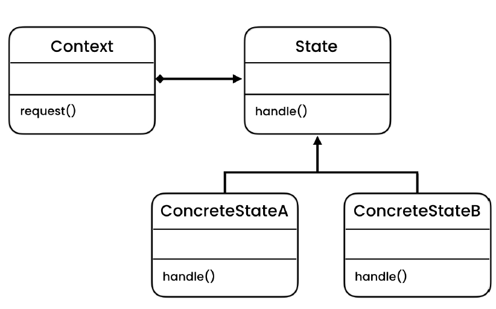

# State Design Pattern
> Allows an object to behave differently depending on the state it is in.

> TODO: Add more examples and use cases for this

## Intent
State is a behavioral design pattern that lets an object alter its behavior when its internal state changes. It appears 
as if the object changed its class.

This structure may look similar to the Strategy pattern, but there’s one key difference. In the State pattern, the particular
states may be aware of each other and initiate transitions from one state to another, whereas strategies almost never 
know about each other.

## Problem
- When our decision making statements are not fixed and can be extended in the future.
- It is difficult to extend our code. For instance check "problem" code, if we want to introduce new tool
    - We need to update the conditional logic of the mouseUp and mouseDown, which thereby violates the OCP (Open/Close Principle)
    - A new "elseif" is needed for each type of tool  supported in the the "Canvas"
    - If we add keyboard event then we need to repeat that process
      
## Solution
- Promotes open/close principle
    - we can add more class without modifying existing code.
    - Why we need it?
        - When someone changes something/or introduces something in the class and breaks everything.
        - So every time we need a feature, we just plug our new class and we test that feature without thinking about the sibling classes
        - We test our newly injected object independently
- Don't abuse this pattern if the states are limited and can't be changed. For eg a stopwatch can be stop and start not more than that
    - There is no need to over engineer it using this pattern. A simple if or switch is good enough. Check "abuse" example

## Applicability
- **Use the State pattern when you have an object that behaves differently depending on its current state, the number of states is enormous, and the state-specific code changes frequently.**
    - The pattern suggests that you extract all state-specific code into a set of distinct classes. As a result, you can add new states or change existing ones independently of each other, reducing the maintenance cost.

- **Use the pattern when you have a class polluted with massive conditionals that alter how the class behaves according to the current values of the class’s fields.**
    - The State pattern lets you extract branches of these conditionals into methods of corresponding state classes. While doing so, you can also clean temporary fields and helper methods involved in state-specific code out of your main class.

- **Use State when you have a lot of duplicate code across similar states and transitions of a condition-based state machine.**
    - The State pattern lets you compose hierarchies of state classes and reduce duplication by extracting common code into abstract base classes.

## Code
- [Problem - 1](./src/main/java/com/rohan/dp/state/problem/ex1)
- [Problem - 2](./src/main/java/com/rohan/dp/state/problem/ex2)
- [Example - 1](./src/main/java/com/rohan/dp/state/solution/ex1)
- [Example - 2](./src/main/java/com/rohan/dp/state/solution/ex2)
- [Abusing Pattern](./src/main/java/com/rohan/dp/state/solution/abuse)

## UML

