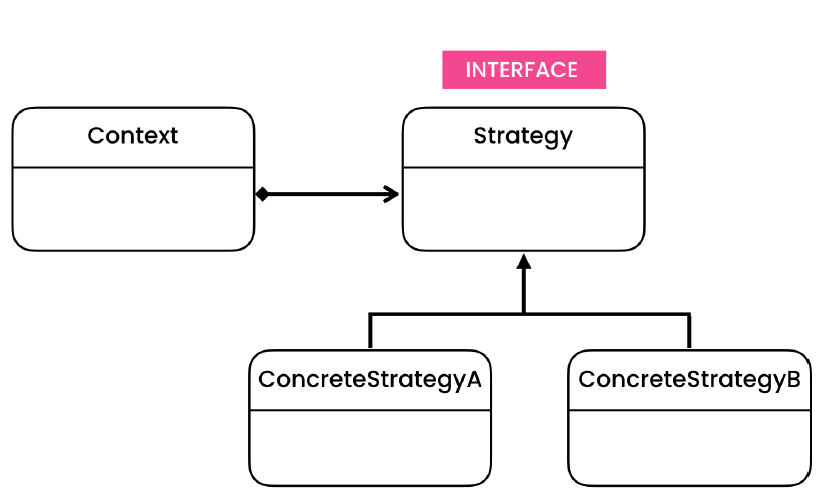
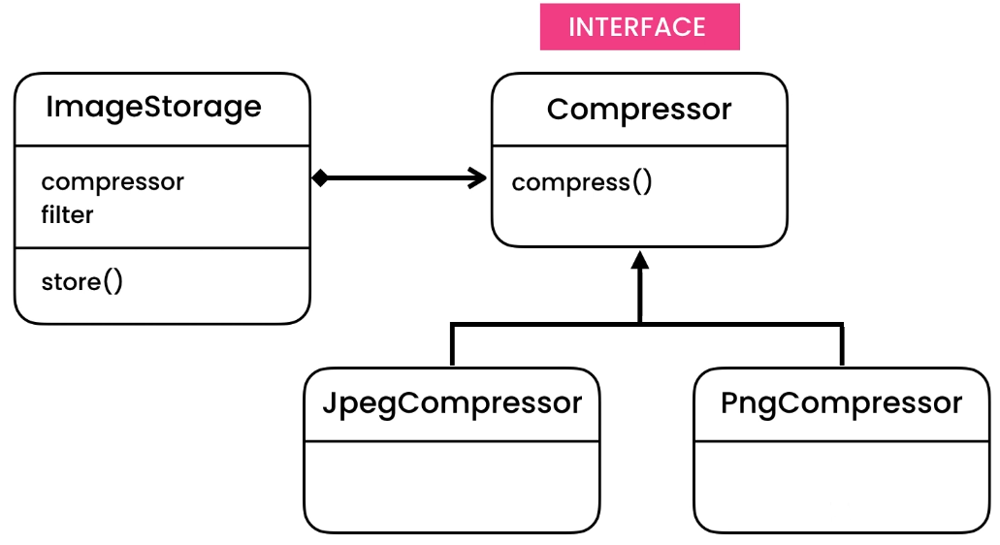

# Strategy Design Pattern
>Allows passing different algorithms (behaviours) to an object.

## Intent
Strategy is a behavioral design pattern that lets you define a family of algorithms, put each of them into a separate
class, and make their objects interchangeable.

It is very similar to state pattern which has a different implementation depending on the single state it depends on.
but in strategy pattern we have set of different behavior which are independent of each other.

## Problem
- For every new type of behavior we need to add an extra else if to take care of new requirement.
- It violates for Single Responsibility Principle
    - Inside storing the image we are also doing compression and filtering
      
## Solution
- To solve SRP, extract out the responsibility to separate interfaces
    - Create concrete implementation for this interface to have different strategy. check UML
- By working with an interface and giving the possibility to add new implementation, we promote OCP.
    - So, in our example the user of compressor doesn't need to care about compression algorithm as it 

## Applicability
- **Use the Strategy pattern when you want to use different variants of an algorithm within an object and be able to switch from one algorithm to another during runtime.**
    - The Strategy pattern lets you indirectly alter the object’s behavior at runtime by associating it with different sub-objects which can perform specific sub-tasks in different ways.

- **Use the Strategy when you have a lot of similar classes that only differ in the way they execute some behavior.**
    - The Strategy pattern lets you extract the varying behavior into a separate class hierarchy and combine the original classes into one, thereby reducing duplicate code.
    
- **Use the pattern to isolate the business logic of a class from the implementation details of algorithms that may not be as important in the context of that logic.**
    - The Strategy pattern lets you isolate the code, internal data, and dependencies of various algorithms from the rest of the code. Various clients get a simple interface to execute the algorithms and switch them at runtime.

- **Use the pattern when your class has a massive conditional operator that switches between different variants of the same algorithm.**
    - The Strategy pattern lets you do away with such a conditional by extracting all algorithms into separate classes, all of which implement the same interface. The original object delegates execution to one of these objects, instead of implementing all variants of the algorithm.

## Code
- [Problem - 1](./src/main/java/com/rohan/dp/strategy/problem/ex1)
- [Problem - 2](./src/main/java/com/rohan/dp/strategy/problem/ex2)
- [Example - 1](./src/main/java/com/rohan/dp/strategy/solution/ex1)
- [Example - 2](src/main/java/com/rohan/dp/strategy/solution/ex2)

## UML

