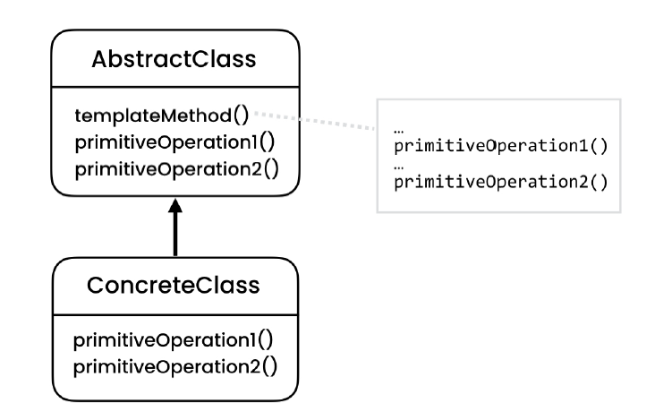
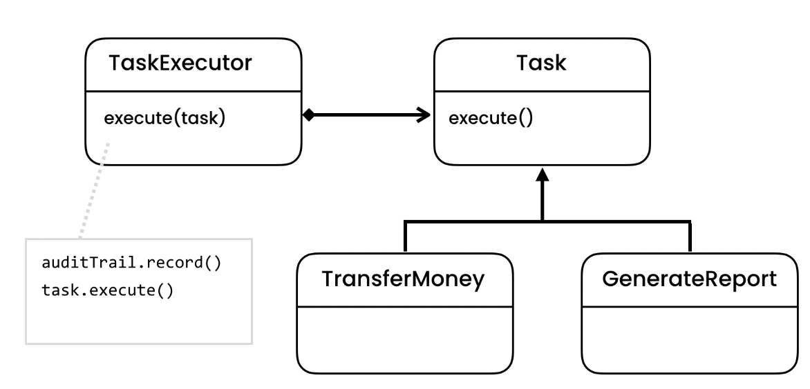
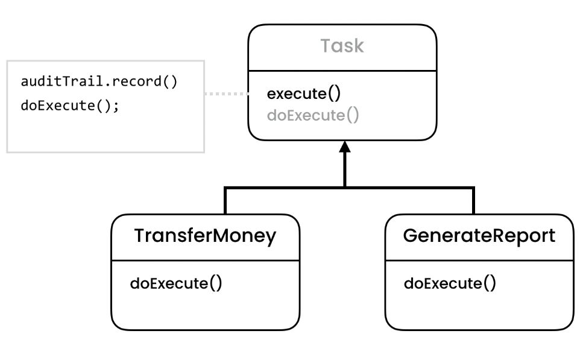

# Template Design Pattern
> Allows defining a template (skeleton) for an operation. Specific steps will then be implemented in subclasses.

## Intent
Template Method is a behavioral design pattern that defines the skeleton of an algorithm in the superclass but lets
 subclasses override specific steps of the algorithm without changing its structure.

## Problem
- Following our example
    - Duplication of code
    - Every time we create a class, we have to follow a structure. And its possible a developer might make a mistake
     following specific order for recording in the audit trail.
     
## Solution
- Using inheritance
    - Move common behavior to abstract class and provide abstract method
- Using polymorphism
    - By using Strategy Pattern
- Methods in the abstract class are also called "Hooks". Which means we have general implementation across it and hook is something
which will be identified during runtime.
- Use "protected" to hide hooks visibility

## Applicability
- **Use the Template Method pattern when you want to let clients extend only particular steps of an algorithm, but not the whole algorithm or its structure.**
    - The Template Method lets you turn a monolithic algorithm into a series of individual steps which can be easily extended by subclasses while keeping intact the structure defined in a superclass.
- **Use the pattern when you have several classes that contain almost identical algorithms with some minor differences. As a result, you might need to modify all classes when the algorithm changes.**
    - When you turn such an algorithm into a template method, you can also pull up the steps with similar implementations into a superclass, eliminating code duplication. Code that varies between subclasses can remain in subclasses.

## Code
- [Problem - 1](./src/main/java/com/rohan/dp/template/problem/ex1)
- [Problem - 2](./src/main/java/com/rohan/dp/template/problem/ex2)
- [Example - 1](./src/main/java/com/rohan/dp/template/solution/ex1)
- [Example - 2](./src/main/java/com/rohan/dp/template/solution/ex2)

## UML

Using Polymorphism

Using Inheritance

