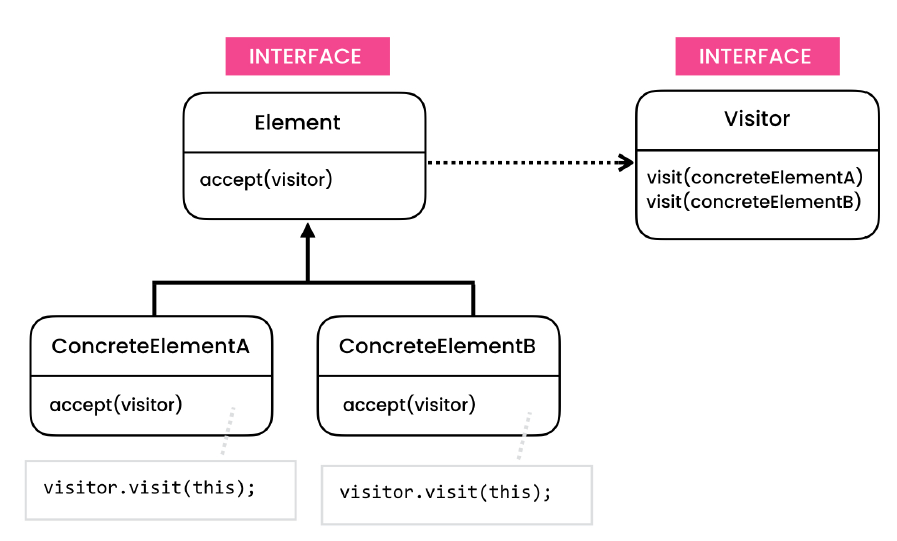
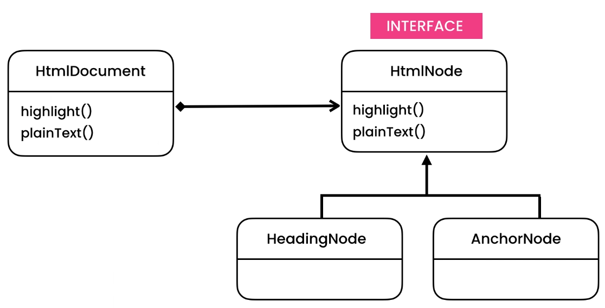
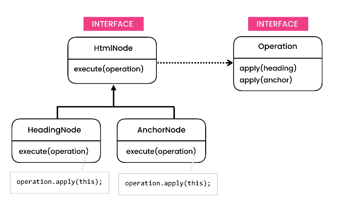

# Visitor Design Pattern

> Allows adding new operations to an object structure without modifying it.

## Intent

Visitor is a behavioral design pattern that lets you separate algorithms from the objects on which they operate.

## Problem

- HTML Editor
    - Everytime we introduce a new function of the editor, we need to go to each component implementing that feature
    - This violates the open closed principle because everytime we need to add new function, we have to update every
      type in our application.
    - The logic for each operation is spread over different classes (check problem uml)
        - highlight
            - present in heading and anchor

## Solution
- Our class changes everytime we introduce a new operation/function.
      - So idea is to introduce each operation using an interface
        - method overloading
        - follows OCP
- Only use this pattern when the object structure is stable.
    - this means you don't foresee number of object increasing in future
    - If it is not stable then we need to update the Operation interface everytime.

## Applicability

- **Use the Visitor when you need to perform an operation on all elements of a complex object structure (for example, an
  object tree).**
    - The Visitor pattern lets you execute an operation over a set of objects with different classes by having a visitor
      object implement several variants of the same operation, which correspond to all target classes.

- **Use the Visitor to clean up the business logic of auxiliary behaviors.**
    - The pattern lets you make the primary classes of your app more focused on their main jobs by extracting all other
      behaviors into a set of visitor classes.

- **Use the pattern when a behavior makes sense only in some classes of a class hierarchy, but not in others.**
    - You can extract this behavior into a separate visitor class and implement only those visiting methods that accept
      objects of relevant classes, leaving the rest empty.

## Code

- [Problem - 1](./src/main/java/com/rohan/dp/visitor/problem/ex1)
- [Solution - 1](./src/main/java/com/rohan/dp/visitor/solution/ex1)
- [Problem - 2](./src/main/java/com/rohan/dp/visitor/problem/ex2)
- [Solution - 2](./src/main/java/com/rohan/dp/visitor/solution/ex2)

## UML

- Problem - 1

- Solution - 1

