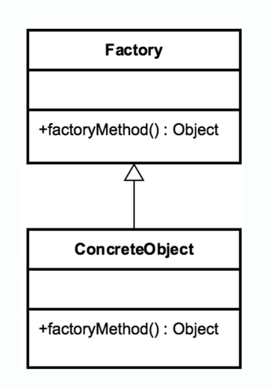

# Factory Design Pattern

> Create object without exposing the creation logic to the client and refer to newly created object using a common interface

## Intent

Factory Method is a creational design pattern that provides an interface for creating objects in a superclass, but
allows subclasses to alter the type of objects that will be created.

## Problem

## Solution

- Factory is responsible for lifecycle
    - Creating instances
- Common interface
- Concrete Classes
    - Client is unaware
- Parameterized create method (Factory method)
- Subclasses are always involved
- Adaptable to environment more easily
- Eg. Calendar class
- Prefer enums over string when fetching a particular type
    - forces user to provide the correct type

## Applicability

- **Use the Factory Method when you don’t know beforehand the exact types and dependencies of the objects your code
  should work with**.
    - The Factory Method separates product construction code from the code that actually uses the product. Therefore
      it’s easier to extend the product construction code independently from the rest of the code.
    - For example, to add a new product type to the app, you’ll only need to create a new creator subclass and override
      the factory method in it.

- **Use the Factory Method when you want to provide users of your library or framework with a way to extend its internal
  components.**
    - Inheritance is probably the easiest way to extend the default behavior of a library or framework. But how would
      the framework recognize that your subclass should be used instead of a standard component?
    - The solution is to reduce the code that constructs components across the framework into a single factory method
      and let anyone override this method in addition to extending the component itself.
    - Let’s see how that would work. Imagine that you write an app using an open source UI framework. Your app should
      have round buttons, but the framework only provides square ones. You extend the standard Button class with a
      glorious RoundButton subclass. But now you need to tell the main UIFramework class to use the new button subclass
      instead of a default one.
    - To achieve this, you create a subclass UIWithRoundButtons from a base framework class and override its
      createButton method. While this method returns Button objects in the base class, you make your subclass return
      RoundButton objects. Now use the UIWithRoundButtons class instead of UIFramework. And that’s about it!

## Code

- [Examples](src/main/java/com/rohan/dp/factory)

## UML

