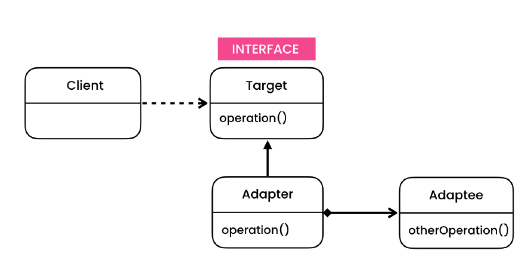
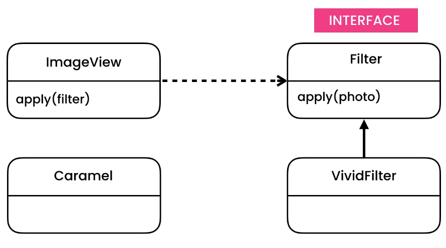
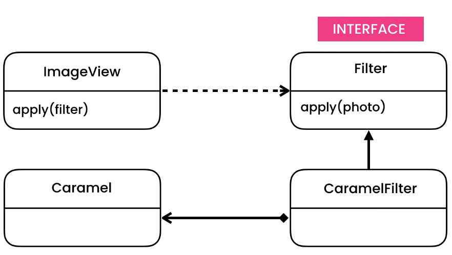

# Adapter Design Pattern

> Allows converting the interface of a class into another interface that clients expect.

## Intent

Adapter is a structural design pattern that allows objects with incompatible interfaces to collaborate.

## Problem

- Mobile App Pretty Filters (Check UML)

## Solution

- We use it in situations where we have an existing class and we want to use it somewhere the interface is different.
- 2 approach
    - Using composition (Preferred and more flexible)
    - Using inheritance (Due to multiple inheritance limitation, we cannot do much if the target is an abstract class)

## Applicability

- **Use the Adapter class when you want to use some existing class, but its interface isn’t compatible with the rest of
  your code.**
    - The Adapter pattern lets you create a middle-layer class that serves as a translator between your code and a
      legacy class, a 3rd-party class or any other class with a weird interface.
- **Use the pattern when you want to reuse several existing subclasses that lack some common functionality that can’t be
  added to the superclass.**
    - You could extend each subclass and put the missing functionality into new child classes. However, you’ll need to
      duplicate the code across all of these new classes, which smells really bad.

## Code

- [Problem - 1](./src/main/java/com/rohan/dp/adapter/problem/ex1)
- [Solution - 1](./src/main/java/com/rohan/dp/adapter/solution/ex1)
- [Problem - 1](./src/main/java/com/rohan/dp/adapter/problem/ex2)
- [Solution - 2](./src/main/java/com/rohan/dp/adapter/solution/ex2)

## UML

- Problem

- Solution

