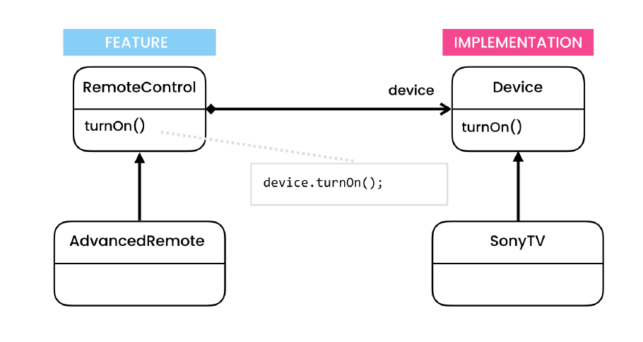
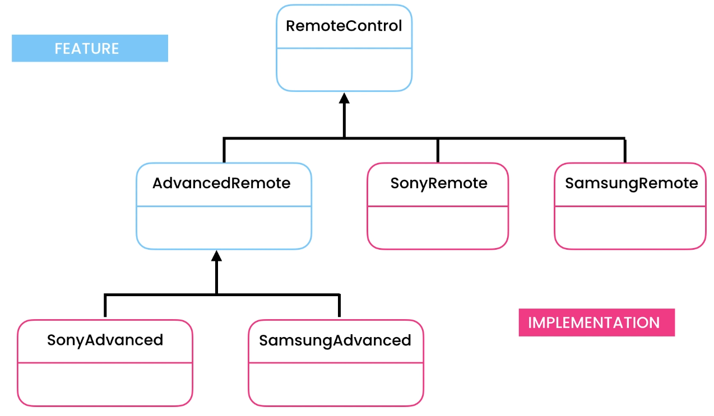
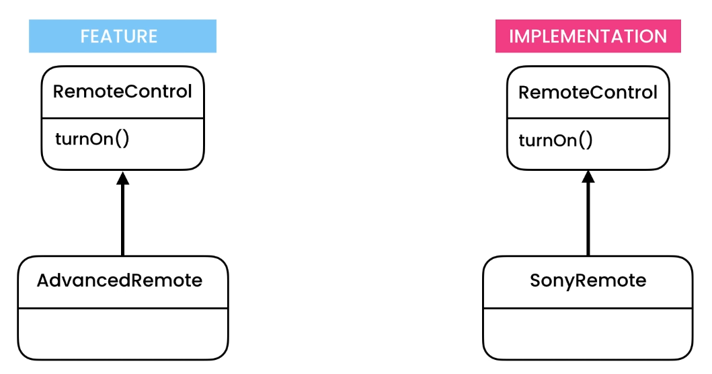

# Bridge Design Pattern

> Allows representing hierarchies that grow in two different dimensions independently

## Intent

Bridge is a structural design pattern that lets you split a large class or a set of closely related classes into two
separate hierarchies—abstraction and implementation—which can be developed independently of each other

## Problem

- Universal Remote Control app

## Solution

- Connecting to independent heirachy using composition.
    - Feature
    - Implementation

## Applicability

- **Use the Bridge pattern when you want to divide and organize a monolithic class that has several variants of some
  functionality (for example, if the class can work with various database servers).**
    - The bigger a class becomes, the harder it is to figure out how it works, and the longer it takes to make a change.
      The changes made to one of the variations of functionality may require making changes across the whole class,
      which often results in making errors or not addressing some critical side effects.
    - The Bridge pattern lets you split the monolithic class into several class hierarchies. After this, you can change
      the classes in each hierarchy independently of the classes in the others. This approach simplifies code
      maintenance and minimizes the risk of breaking existing code.
- **Use the pattern when you need to extend a class in several orthogonal (independent) dimensions.**
    - The Bridge suggests that you extract a separate class hierarchy for each of the dimensions. The original class
      delegates the related work to the objects belonging to those hierarchies instead of doing everything on its own.
- **Use the Bridge if you need to be able to switch implementations at runtime.**
    - Although it’s optional, the Bridge pattern lets you replace the implementation object inside the abstraction. It’s
      as easy as assigning a new value to a field.
    - By the way, this last item is the main reason why so many people confuse the Bridge with the Strategy pattern.
      Remember that a pattern is more than just a certain way to structure your classes. It may also communicate intent
      and a problem being addressed.

## Code

- [Problem](./src/main/java/com/rohan/dp/bridge/problem)
- [Solution - 1](./src/main/java/com/rohan/dp/bridge/solution)

## UML

- Problem
    - Very inflexible
    - If tomorrow we want to support new type of remote control customized for watching movies, we need to add a new
      class MoviesRemoteControl (extending RemoteControl class).
        - For this new class we need to define implementation for every TV brand we support.
        - So 10 TV brands to 10 new implementations
    - Overtime this heirarchy will become very complex.

- Solution
    - Our heirarchy is growing in 2 different dimensions
        - Features
        - Implementation (or TV Brands)
    - We break it down into half

