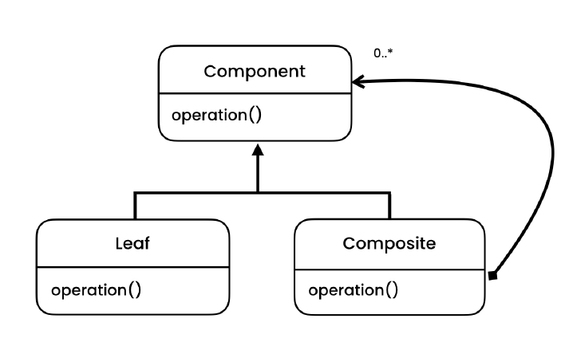
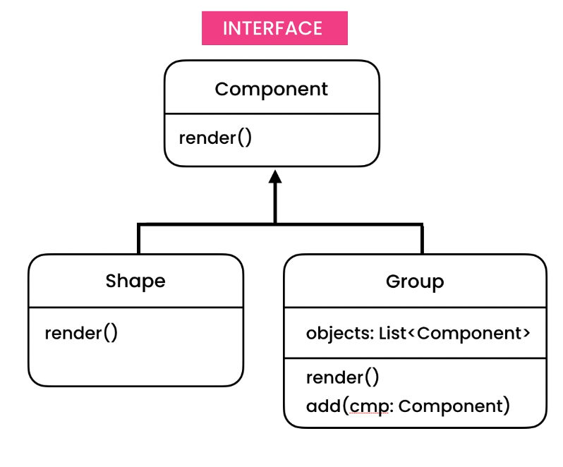

# Composite Design Pattern

> Represents object hierarchies where individual objects and compositions of objects are treated the same way.

## Intent

Composite is a structural design pattern that lets you compose objects into tree structures and then work with these
structures as if they were individual objects.

## Problem

- Filesystem
- We need explicit casting to call the function on the correct type
    - Check problem 1
    - If we need to introduce a new function for the objects in the hierarchy, we have to explicitly cast them

## Solution

## Applicability

- **Use the Composite pattern when you have to implement a tree-like object structure.**
    - The Composite pattern provides you with two basic element types that share a common interface: simple leaves and
      complex containers. A container can be composed of both leaves and other containers. This lets you construct a
      nested recursive object structure that resembles a tree.

- **Use the pattern when you want the client code to treat both simple and complex elements uniformly.**
    - All elements defined by the Composite pattern share a common interface. Using this interface, the client doesn’t
      have to worry about the concrete class of the objects it works with.

## Code

- [Problem - 1](./src/main/java/com/rohan/dp/composite/problem/ex1)
- [Solution - 1](./src/main/java/com/rohan/dp/composite/solution/ex1)
- [Problem - 2](./src/main/java/com/rohan/dp/composite/problem/ex2)
- [Solution - 2](./src/main/java/com/rohan/dp/composite/solution/ex2)

## UML

- Problem 1

