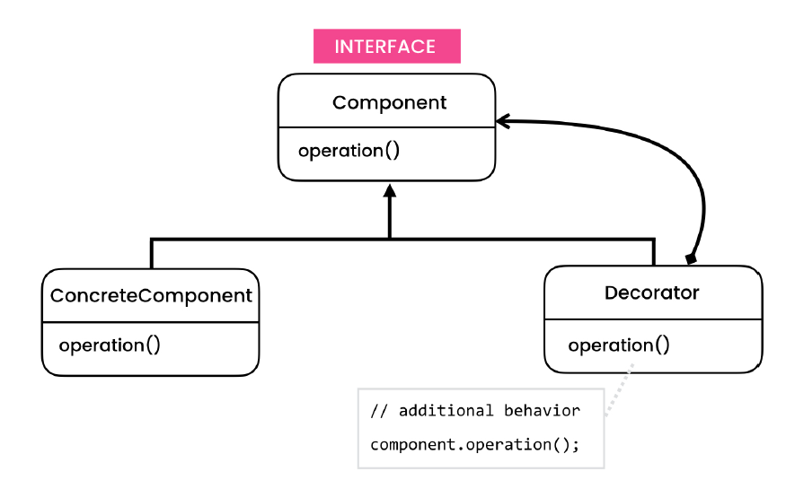
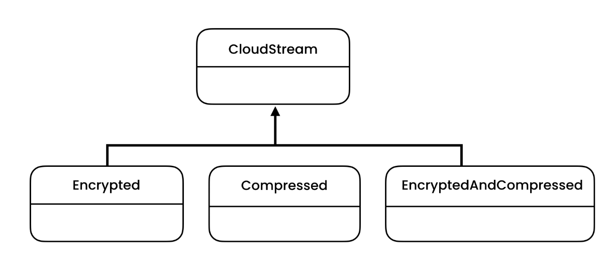
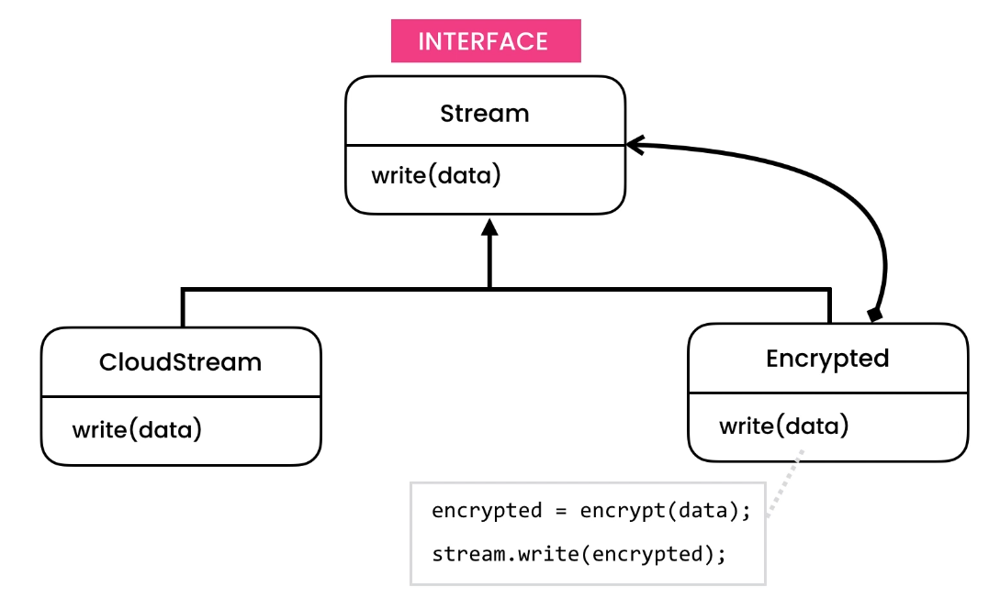

# Decorator Design Pattern

> Adds additional behavior to an object dynamically.

## Intent

Decorator is a structural design pattern that lets you attach new behaviors to objects by placing these objects inside
special wrapper objects that contain the behaviors.

## Problem
- lot of unnecessary combination of classes. Inheritance misuse 

## Solution
- Favor composition over inheritance
   

## Applicability

- **Use the Decorator pattern when you need to be able to assign extra behaviors to objects at runtime without
  breaking**
  the code that uses these objects.
    - The Decorator lets you structure your business logic into layers, create a decorator for each layer and compose
      objects with various combinations of this logic at runtime. The client code can treat all these objects in the
      same way, since they all follow a common interface.

- **Use the pattern when it’s awkward or not possible to extend an object’s behavior using inheritance.**
    - Many programming languages have the final keyword that can be used to prevent further extension of a class. For a
      final class, the only way to reuse the existing behavior would be to wrap the class with your own wrapper, using
      the Decorator pattern.

## Code

- [Problem](./src/main/java/com/rohan/dp/decorator/problem)
- [Solution](./src/main/java/com/rohan/dp/decorator/solution/)

## UML

- Problem

- Solution

