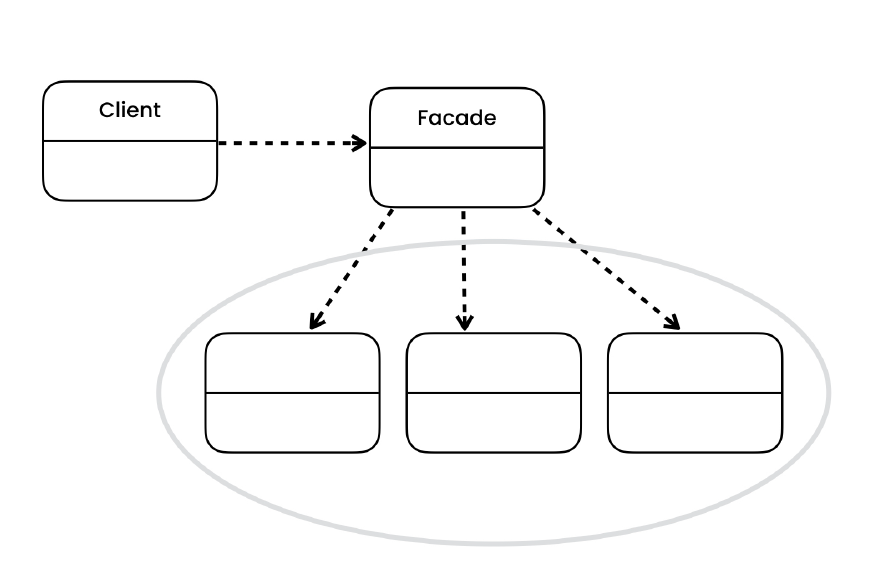
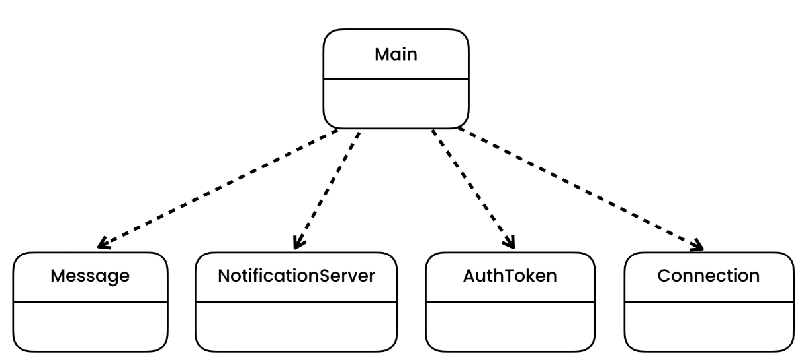
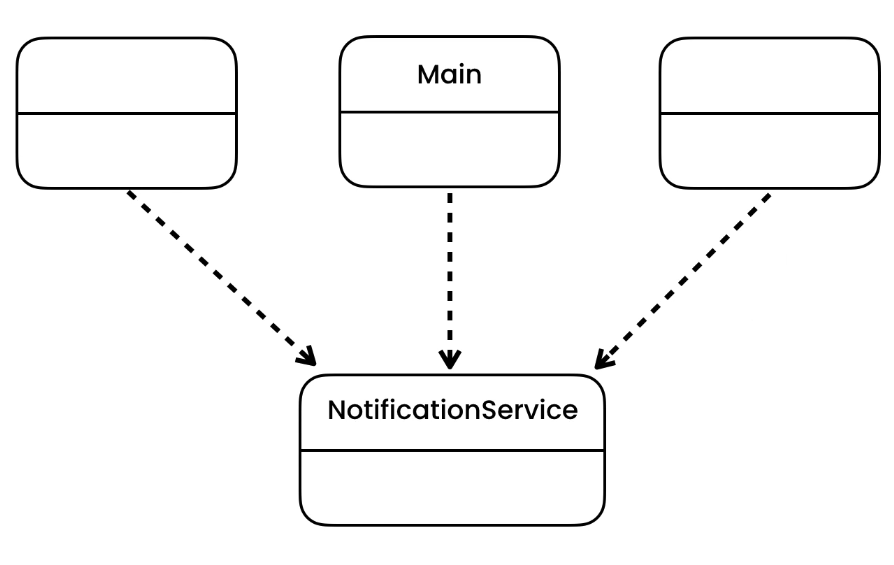

# Facade Design Pattern

> Provides a simplified, higher-level interface to a subsystem. Clients can talk to the facade rather than individual classes in the subsystem.

## Intent

Facade is a structural design pattern that provides a simplified interface to a library, a framework, or any other
complex set of classes.

## Problem

- TODO

## Solution

- We provide one point of contact to the accessors, rather than sharing complex implementation details. So, if anything
  changes in future, the new changes are limited to single class, not everywhere in the application.
- "Service" is facade  

## Applicability

- **Use the Facade pattern when you need to have a limited but straightforward interface to a complex subsystem.**
    - Often, subsystems get more complex over time. Even applying design patterns typically leads to creating more
      classes. A subsystem may become more flexible and easier to reuse in various contexts, but the amount of
      configuration and boilerplate code it demands from a client grows ever larger. The Facade attempts to fix this
      problem by providing a shortcut to the most-used features of the subsystem which fit most client requirements.

- **Use the Facade when you want to structure a subsystem into layers.**
    - Create facades to define entry points to each level of a subsystem. You can reduce coupling between multiple
      subsystems by requiring them to communicate only through facades.

For example, let’s return to our video conversion framework. It can be broken down into two layers: video- and
audio-related. For each layer, you can create a facade and then make the classes of each layer communicate with each
another via those facades. This approach looks very similar to the Mediator pattern.

## Code

- [Problem](./src/main/java/com/rohan/dp/facade/problem)
- [Solution](./src/main/java/com/rohan/dp/facade/solution)

## UML

- Problem

- Solution

