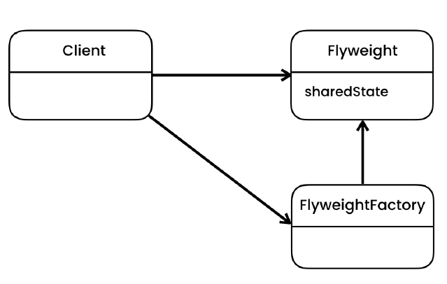
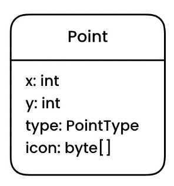
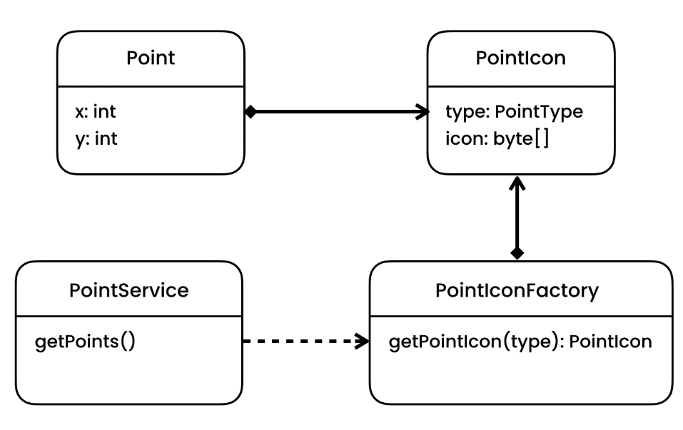

# Flyweight Design Pattern

> Allows sharing common state between multiple objects

## Intent

Flyweight is a structural design pattern that lets you fit more objects into the available amount of RAM by sharing
common parts of state between multiple objects instead of keeping all of the data in each object.

## Problem

- Sometimes we have structures or object that can take significant amount of memory.
- An object having an image (in bytes) let say 20KB. By only instantiating 1000 objects will consume 20MB from RAM.
    - This is unnecessary as we can store the common object else where and reuse them
- Check UML
    - icon class can take lot of memory depending on the number of objects we are supporting

## Solution

- Idea is to maintain a cache of heavy objects in single place in memory. (Benefits)
- So with the flyweight pattern we need to separate the data that we need to share. Store it somewhere else in a
  flyweight class (PointIcon) and then implement a factory caching these objects.

## Applicability

- **Use the Flyweight pattern only when your program must support a huge number of objects which barely fit into
  available RAM.**
    - The benefit of applying the pattern depends heavily on how and where it’s used. It’s most useful when:
        - an application needs to spawn a huge number of similar objects
        - this drains all available RAM on a target device
        - the objects contain duplicate states which can be extracted and shared between multiple objects

## Code

- [Problem](./src/main/java/com/rohan/dp/flyweight/problem)
- [Solution](./src/main/java/com/rohan/dp/flyweight/solution)

## UML

- Problem

- Solution

