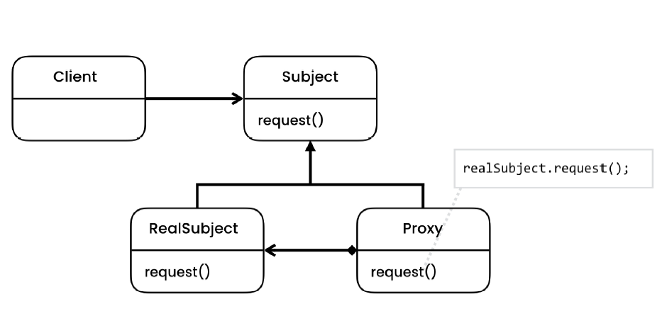

# Proxy Design Pattern

> Allows providing a substitute for another object. The proxy object delegates all the work to the target object and contains some additional behavior.

## Intent
// TODO
## Problem

## Solution

## Applicability

## Code

- [Problem](./src/main/java/com/rohan/dp/proxy/problem)
- [Solution](./src/main/java/com/rohan/dp/proxy/solution)

## UML

